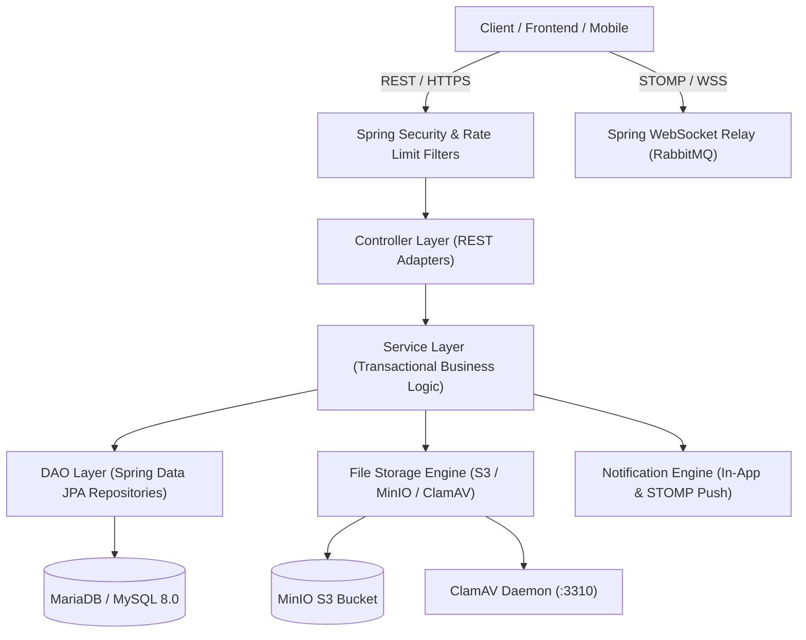

# SoukLab Backend - Production Spring Boot Architecture

Enterprise-grade Spring Boot backend platform dedicated to the preservation, discovery, and commercialization of Algerian traditional crafts and craftsmanship heritage.

---

## Architecture Overview

SoukLab follows a decoupled layered architecture adhering to Domain-Driven Design (DDD) principles:



---

## Core Modules & Capabilities

| Module | Core Responsibility | Key Technologies |
| :--- | :--- | :--- |
| **Authentication & Authorization** | Stateless JWT authentication, database-backed granular permissions and centralized domain policies, email verification codes, password reset lifecycle, OAuth2 Google login. | Spring Security, JJWT (HS256), BCrypt |
| **User & Profile Management** | Artisan public profiles, profile completion wizard, permission-aware contact gating, profile view metrics deduplication. | Spring Data JPA, Jakarta Validation |
| **Public Directory & Search** | Full-text scored search, faceted discovery (Wilayas, categories, materials, epoques, techniques), accent folding, edge n-grams, and JPA criteria fallback. | Hibernate Search 8.2.2.Final, Elasticsearch 8.x |
| **Catalog & Craft Taxonomy** | Hierarchical reference data (Wilayas/Communes, Categories/Subcategories, Material Families/Materials, Epochs, Craftsmanship Techniques) and administrative CRUD management with cache eviction and audit trails. | Caffeine Cache, Spring Data JPA |
| **Formations & Peer Workshops** | Peer masterclass authoring (`isTeacher`), syllabus ClamAV scanning, administrative review lifecycle, capacity limits, cancellation deadlines, and client 403 boundary. | Spring Security, ClamAV, Spring Data JPA |
| **Formateur Accreditation** | Artisan teacher certification lifecycle (submission, admin review, cooldown enforcement, direct admin grants/revocations). | Multi-state state machine, Spring Events |
| **Real-Time Messaging** | 1-on-1 private conversations, client premium subscription gating, artisan identity privacy masking (`Artisan #XXXXX`), file attachments, read receipts, typing indicators, and message history via STOMP / WebSocket. | Spring WebSocket, STOMP Relay (RabbitMQ), AMQP |
| **In-App Notifications** | User-scoped notification feeds, unread badge counters, instant WebSocket broadcast, query-scoped soft deletions. | Spring WebSocket, STOMP Relay, JPA Soft Delete |
| **Subscriptions & Payments** | Tiered subscription plans (Free/Pro/Premium), Chargily Pay V2 hosted checkout, signed idempotent webhook processing, renewal reminders. | Chargily Pay V2, Spring Task Scheduling |
| **Platform Analytics & KPI** | Async query jobs, multi-granularity rollups (day/week/month/quarter), CSV data export, outbox pattern event processing. | Spring Batch/Async, S3 Export Storage |
| **File Storage & Avatars** | Multi-tier avatar processing (thumbnail, medium, full), magic number verification, ClamAV streaming antivirus, S3/MinIO bucket storage. | MinIO S3 SDK, Thumbnailator, Clamd instream |
| **Client Favorites** | Private artisan favorites for clients with cap enforcement, pessimistic concurrency lock, and zero N+1 directory card projection. | Spring Data JPA, Pessimistic Locking |
| **Rate Limiting & Security** | Token-bucket sliding window rate limiting on authentication and avatar uploads, Redis-backed or Caffeine-backed with Retry-After headers. | Bucket4j, Redis / Caffeine Cache, OncePerRequestFilter |

---

## Technology Stack

- **Runtime & Language**: Java 21, Spring Boot 4.0.8, Spring Framework 7.x
- **Data Persistence**: Spring Data JPA + Hibernate ORM + MariaDB 11.4
- **Search Engine & Indexing**: Hibernate Search 8.2.2.Final (Elasticsearch 8.15.3 backend)
- **Caching**: Caffeine Cache (catalog taxonomies, local rate limiting buckets), Redis 7.4.1 (distributed rate limiting)
- **Connection Pool**: HikariCP (configured with leak detection and connection pooling)
- **Object Storage**: S3-compatible object store (MinIO for local development, AWS S3 / Cloudflare R2 for production)
- **Security & Antivirus**: Spring Security, JJWT 0.11.5, Bucket4j 8.10.1, ClamAV 1.4 Daemon
- **Realtime Broker**: Spring WebSocket STOMP relay (RabbitMQ 4.0)
- **Build & Quality Tooling**: Maven Wrapper (`./mvnw`), Lombok, JaCoCo, Flyway (V0–V18 migrations), Postman / Newman

---

## Repository Package Structure

```
src/main/java/com/project/souklab/
├── config/              # Infrastructure and cross-cutting framework beans
│   └── search/          # Hibernate Search Elasticsearch analysis config and startup index runner
├── controller/          # REST API entrypoints and HTTP adapters
│   ├── analytics/       # Analytics jobs, rollups rebuild/backfill, and CSV exports
│   ├── artisan/         # Artisan profile, certification, and gallery portfolio endpoints
│   ├── auth/            # Registration, login, /me profile, verification, and password flows
│   ├── catalog/         # Public reference craft taxonomies and administrative taxonomy CRUD
│   ├── chat/            # Private conversation REST endpoints and STOMP message handlers
│   ├── directory/       # Authenticated artisan directory search and faceted filtering
│   ├── favorite/        # Client favorite artisan management endpoints
│   ├── formateur/       # Formateur accreditation and moderation endpoints
│   ├── feed/            # Public feed and post moderation endpoints
│   ├── review/          # Formation-backed artisan review endpoints
│   ├── report/          # Abuse reporting endpoints
│   ├── formation/       # Masterclass authoring, peer enrollment, and review endpoints
│   ├── notification/    # Notification feed and read-state management
│   ├── subscription/    # Tiered plans, checkout, and Chargily Pay V2 webhooks
│   └── user/            # User avatar upload/activation and admin moderation
├── dao/                 # Spring Data JPA repositories (52 repositories)
├── dto/                 # Data Transfer Objects (contracts for API requests/responses)
│   ├── admin/           # Administrative audit representations
│   ├── analytics/       # Analytics query job and rollup representations
│   ├── artisan/         # Certification and gallery image responses
│   ├── auth/            # Login, registration, token refresh, and password DTOs
│   ├── catalog/         # Reference taxonomy and geographic representations
│   ├── chat/            # Conversation and message payloads
│   ├── common/          # Standard response envelopes (ApiResponse, PaginatedResponse)
│   ├── directory/       # Directory search cards and criteria filter DTOs
│   ├── favorite/        # Client favorite responses and directory card items
│   ├── formateur/       # Formateur request and moderation DTOs
│   ├── formation/       # Masterclass authoring, review, enrollment, and file DTOs
│   ├── feed/            # Feed posts, media, and moderation DTOs
│   ├── notification/    # Notification payload representations
│   ├── review/          # Decimal artisan review DTOs
│   ├── report/          # Report and resolution DTOs
│   ├── profile/         # Artisan and client profile representations
│   ├── subscription/    # Subscription and payment representations
│   └── user/            # Moderation requests and avatar responses
├── exception/           # Exception hierarchy and GlobalExceptionHandler
├── filestorage/         # Dedicated object storage engine
│   ├── config/          # MinIO/S3 connection properties
│   ├── controller/      # Direct file streaming endpoints
│   ├── exception/       # File storage exception taxonomy
│   ├── image/           # Image resizing and thumbnailing service
│   ├── lifecycle/       # Post-commit object cleanup
│   ├── s3/              # S3/MinIO service implementation
│   ├── scan/            # ClamAV virus scanning integration
│   ├── security/        # File serving rate limit filter
│   ├── stub/            # In-memory test stubs
│   └── validation/      # Magic bytes and MIME validation
├── model/               # JPA entities and domain enums (53 entities)
├── security/            # JWT, permissions, policy predicates, rate limiting, upload boundaries
├── service/             # Application business logic and transactional services
│   ├── analytics/       # Rollup processing, export generation, and job execution
│   ├── artisan/         # Artisan profile and portfolio operations
│   ├── audit/           # Audit trail logging
│   ├── auth/            # User authentication and details management
│   ├── catalog/         # Cached taxonomy retrieval and administrative catalog management
│   ├── chat/            # Real-time messaging and conversation lifecycle
│   ├── directory/       # Hibernate Search Elasticsearch discovery service
│   ├── favorite/        # Client artisan favorites management
│   ├── formateur/       # Formateur accreditation workflows
│   ├── formation/       # Masterclass lifecycle, peer enrollment, and moderation
│   ├── notification/    # In-app notifications and WebSocket dispatch
│   ├── profile/         # Profile lifecycle, FK taxonomy resolution, and PATCH updates
│   ├── report/          # Content reporting and moderation resolution
│   ├── review/          # Formation-backed review verification and rating rollup
│   ├── security/        # Token issuance and verification
│   ├── storage/         # Application-specific file access policy
│   ├── subscription/    # Subscription lifecycle and Chargily Pay V2 payments
│   └── user/            # User management and avatar processing
├── util/                # Stateless utility functions and mappers
└── validation/          # Custom Jakarta Bean Validation constraints
```

---

## Getting Started

### 1. Prerequisites
- JDK 21 or higher
- Docker & Docker Compose
- Maven 3.8+ (or use repository `./mvnw`)

### 2. Infrastructure Setup
Launch local infrastructure containers:
```bash
docker compose up -d mariadb minio rabbitmq elasticsearch clamav
```

Service endpoints:
- **MariaDB**: `localhost:3306` (Database: `souklab_db`)
- **MinIO S3**: `http://localhost:9000` (Console: `http://localhost:9001`)
- **RabbitMQ**: `localhost:5672` (Management: `http://localhost:15672`)
- **ClamAV**: `localhost:3310`
- **Elasticsearch**: `localhost:9200`

### 3. Build & Run
```bash
# Option A: Run locally with Maven (backing services in Docker)
./mvnw clean test
./mvnw spring-boot:run

# Option B: Run containerized with Docker Compose (using .env.docker)
docker compose up -d --build app
```

The server listens on `http://localhost:8080/api/v1`.

Authorization capabilities and their endpoint/service boundaries are documented in [`docs/AUTHORIZATION_MATRIX.md`](docs/AUTHORIZATION_MATRIX.md). Local development keeps Flyway disabled by default; production enables the versioned migrations and uses Hibernate schema validation.

---

## API Documentation & Testing Suite

- **Documentation index**: See [`docs/README.md`](docs/README.md) for current contracts and [`docs/dev/README.md`](docs/dev/README.md) for developer history and archived material.
- **Business Features Guide**: [`docs/BUSINESS_FEATURES.md`](docs/BUSINESS_FEATURES.md) / [Version française](docs/BUSINESS_FEATURES_FR.md) — Plain-language platform capabilities for business and product stakeholders.
- **Technical Feature Reference**: [`docs/FEATURES.md`](docs/FEATURES.md) / [Version française](docs/FEATURES_FR.md) — Comprehensive, code-derived feature reference (all endpoints, enums, business rules, and 566-case verification ledger).
- **Architecture Codemaps**: [`docs/CODEMAPS/`](docs/CODEMAPS/) — Token-lean system diagrams, route maps, data models, and dependency topologies.
- **API Specification**: See [`docs/API_SPEC.md`](docs/API_SPEC.md) for endpoint references and [`docs/frontend/API_HANDOFF.md`](docs/frontend/API_HANDOFF.md) for frontend integration.
- **Production Audit**: See [`docs/PRODUCTION_AUDIT.md`](docs/PRODUCTION_AUDIT.md) for current readiness findings, evidence, and release gates.
- **Postman API Reference**: The current permission-based contract is documented in [`docs/API_SPEC.md`](docs/API_SPEC.md) and [`docs/AUTHORIZATION_MATRIX.md`](docs/AUTHORIZATION_MATRIX.md). The older generated reference is retained in `docs/dev/` as an archival migration artifact.
- **Postman Test Suite**: The checked-in collection is retained for historical scenarios and must be regenerated before running Newman against the current permission-based API.

---

## Package Documentation Directory

Each individual package across the application contains its own dedicated `README.md` specifying internal classes, contracts, and architecture:

- [`com.project.souklab`](src/main/java/com/project/souklab/README.md) — Application root
- [`com.project.souklab.analytics`](src/main/java/com/project/souklab/analytics/README.md) — Analytics processing engine, outbox relay, event consumer, and KPI rollups
- [`com.project.souklab.config`](src/main/java/com/project/souklab/config/README.md) — Framework configuration
  - [`config.search`](src/main/java/com/project/souklab/config/search/README.md) — Hibernate Search Elasticsearch configuration and startup runner
- [`com.project.souklab.controller`](src/main/java/com/project/souklab/controller/README.md) — Controller layer overview
  - [`controller.analytics`](src/main/java/com/project/souklab/controller/analytics/README.md) — Asynchronous query jobs, CSV artifact downloads, rollups, and platform stats
  - [`controller.artisan`](src/main/java/com/project/souklab/controller/artisan/README.md) — Artisan profile, certification, and gallery portfolio endpoints
  - [`controller.auth`](src/main/java/com/project/souklab/controller/auth/README.md) — Authentication endpoints
  - [`controller.catalog`](src/main/java/com/project/souklab/controller/catalog/README.md) — Reference craft taxonomy endpoints
  - [`controller.chat`](src/main/java/com/project/souklab/controller/chat/README.md) — Private conversation, message lifecycle, attachment, and read-state endpoints
  - [`controller.directory`](src/main/java/com/project/souklab/controller/directory/README.md) — Public artisan directory search endpoints
  - [`controller.favorite`](src/main/java/com/project/souklab/controller/favorite/README.md) — Client favorite artisan endpoints
  - [`controller.feed`](src/main/java/com/project/souklab/controller/feed/README.md) — Public feed and admin moderation endpoints
  - [`controller.formateur`](src/main/java/com/project/souklab/controller/formateur/README.md) — Formateur accreditation endpoints
  - [`controller.formation`](src/main/java/com/project/souklab/controller/formation/README.md) — Formations authoring, peer enrollment, and review endpoints
  - [`controller.notification`](src/main/java/com/project/souklab/controller/notification/README.md) — Notification endpoints
  - [`controller.report`](src/main/java/com/project/souklab/controller/report/README.md) — Abuse reporting endpoints
  - [`controller.review`](src/main/java/com/project/souklab/controller/review/README.md) — Artisan review endpoints
  - [`controller.subscription`](src/main/java/com/project/souklab/controller/subscription/README.md) — Subscription plans, Chargily Pay V2 checkout, webhooks, and refunds
  - [`controller.user`](src/main/java/com/project/souklab/controller/user/README.md) — User and avatar endpoints
- [`com.project.souklab.dao`](src/main/java/com/project/souklab/dao/README.md) — Persistence repositories (52 repositories across DAO packages)
  - [`dao.analytics`](src/main/java/com/project/souklab/dao/analytics/README.md) — Analytics outbox, activity event, job artifact, and rollup repositories
- [`com.project.souklab.dto`](src/main/java/com/project/souklab/dto/README.md) — DTO taxonomy
  - [`dto.admin`](src/main/java/com/project/souklab/dto/admin/README.md) — Admin audit DTOs
  - [`dto.analytics`](src/main/java/com/project/souklab/dto/analytics/README.md) — Query job requests, execution responses, rollups, and CSV artifact payloads
  - [`dto.artisan`](src/main/java/com/project/souklab/dto/artisan/README.md) — Portfolio certification and gallery response DTOs
  - [`dto.auth`](src/main/java/com/project/souklab/dto/auth/README.md) — Authentication DTOs
  - [`dto.catalog`](src/main/java/com/project/souklab/dto/catalog/README.md) — Reference taxonomy DTOs
  - [`dto.chat`](src/main/java/com/project/souklab/dto/chat/README.md) — Conversation descriptors, message payloads, typing commands, and WebSocket events
  - [`dto.common`](src/main/java/com/project/souklab/dto/common/README.md) — Response envelopes
  - [`dto.directory`](src/main/java/com/project/souklab/dto/directory/README.md) — Directory search cards and criteria filter DTOs
  - [`dto.favorite`](src/main/java/com/project/souklab/dto/favorite/README.md) — Client favorite responses and directory card items
  - [`dto.feed`](src/main/java/com/project/souklab/dto/feed/README.md) — Moderated feed post, media, and moderation payloads
  - [`dto.formateur`](src/main/java/com/project/souklab/dto/formateur/README.md) — Formateur DTOs
  - [`dto.formation`](src/main/java/com/project/souklab/dto/formation/README.md) — Formation authoring, review, enrollment, and file DTOs
  - [`dto.notification`](src/main/java/com/project/souklab/dto/notification/README.md) — Notification DTOs
  - [`dto.profile`](src/main/java/com/project/souklab/dto/profile/README.md) — Profile representations
  - [`dto.report`](src/main/java/com/project/souklab/dto/report/README.md) — Report submission, resolution, and moderation responses
  - [`dto.review`](src/main/java/com/project/souklab/dto/review/README.md) — Decimal formation review requests and responses
  - [`dto.subscription`](src/main/java/com/project/souklab/dto/subscription/README.md) — Subscription plan, checkout, payment, and webhook log DTOs
  - [`dto.user`](src/main/java/com/project/souklab/dto/user/README.md) — User and avatar DTOs
- [`com.project.souklab.exception`](src/main/java/com/project/souklab/exception/README.md) — Exception handling
- [`com.project.souklab.filestorage`](src/main/java/com/project/souklab/filestorage/README.md) — Storage engine
  - [`filestorage.config`](src/main/java/com/project/souklab/filestorage/config/README.md) — S3 configuration
  - [`filestorage.controller`](src/main/java/com/project/souklab/filestorage/controller/README.md) — File streaming controller
  - [`filestorage.exception`](src/main/java/com/project/souklab/filestorage/exception/README.md) — Storage exceptions
  - [`filestorage.image`](src/main/java/com/project/souklab/filestorage/image/README.md) — Image processing service
  - [`filestorage.lifecycle`](src/main/java/com/project/souklab/filestorage/lifecycle/README.md) — Post-commit object cleanup
  - [`filestorage.s3`](src/main/java/com/project/souklab/filestorage/s3/README.md) — MinIO/S3 client
  - [`filestorage.scan`](src/main/java/com/project/souklab/filestorage/scan/README.md) — ClamAV scanner
  - [`filestorage.security`](src/main/java/com/project/souklab/filestorage/security/README.md) — Download rate limiting
  - [`filestorage.stub`](src/main/java/com/project/souklab/filestorage/stub/README.md) — In-memory test stubs
  - [`filestorage.validation`](src/main/java/com/project/souklab/filestorage/validation/README.md) — File validation
- [`com.project.souklab.integration`](src/main/java/com/project/souklab/integration/README.md) — External third-party API integrations
  - [`integration.chargily`](src/main/java/com/project/souklab/integration/chargily/README.md) — Chargily Pay V2 client, webhook payloads, and mappers
- [`com.project.souklab.model`](src/main/java/com/project/souklab/model/README.md) — Domain entities and lifecycle enums
  - [`model.analytics`](src/main/java/com/project/souklab/model/analytics/README.md) — Analytics activity events, outbox records, jobs, and KPI rollups
- [`com.project.souklab.security`](src/main/java/com/project/souklab/security/README.md) — Security filters and token parsing
- [`com.project.souklab.service`](src/main/java/com/project/souklab/service/README.md) — Service layer architecture
  - [`service.artisan`](src/main/java/com/project/souklab/service/artisan/README.md) — Artisan profile and portfolio services
  - [`service.audit`](src/main/java/com/project/souklab/service/audit/README.md) — Audit trail logging
  - [`service.auth`](src/main/java/com/project/souklab/service/auth/README.md) — Authentication workflows
  - [`service.catalog`](src/main/java/com/project/souklab/service/catalog/README.md) — Cached taxonomy retrieval service
  - [`service.chat`](src/main/java/com/project/souklab/service/chat/README.md) — Realtime 1-on-1 conversations, message delivery, read receipts, and typing indicators
  - [`service.directory`](src/main/java/com/project/souklab/service/directory/README.md) — Hibernate Search Elasticsearch discovery service
  - [`service.favorite`](src/main/java/com/project/souklab/service/favorite/README.md) — Client artisan favorites management
  - [`service.feed`](src/main/java/com/project/souklab/service/feed/README.md) — Feed post lifecycle and media storage
  - [`service.formateur`](src/main/java/com/project/souklab/service/formateur/README.md) — Formateur management
  - [`service.formation`](src/main/java/com/project/souklab/service/formation/README.md) — Masterclass lifecycle, peer enrollment, and moderation
  - [`service.notification`](src/main/java/com/project/souklab/service/notification/README.md) — Notification dispatcher
  - [`service.profile`](src/main/java/com/project/souklab/service/profile/README.md) — User profile management and taxonomy resolution
  - [`service.report`](src/main/java/com/project/souklab/service/report/README.md) — Report validation and moderation actions
  - [`service.review`](src/main/java/com/project/souklab/service/review/README.md) — Formation-backed artisan reviews
  - [`service.security`](src/main/java/com/project/souklab/service/security/README.md) — Token and verification services
  - [`service.storage`](src/main/java/com/project/souklab/service/storage/README.md) — File ownership and enrollment access policy
  - [`service.subscription`](src/main/java/com/project/souklab/service/subscription/README.md) — Subscription checkout, Chargily Pay V2 HMAC webhooks, and refund execution
  - [`service.user`](src/main/java/com/project/souklab/service/user/README.md) — User moderation and avatars
- [`com.project.souklab.util`](src/main/java/com/project/souklab/util/README.md) — Helper utilities
- [`com.project.souklab.validation`](src/main/java/com/project/souklab/validation/README.md) — Custom validator annotations
