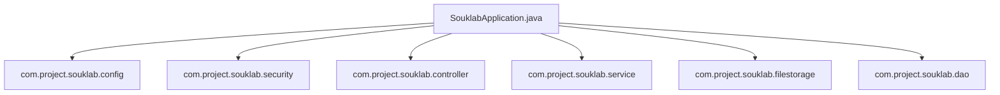

# SoukLab Application Root (`com.project.souklab`)

Root package containing the main Spring Boot bootstrap entrypoint and foundational package declarations.

---

## Architecture Role

The root package serves as the component scanning origin (`@SpringBootApplication`). All child packages (`config`, `controller`, `service`, `dao`, `model`, `dto`, `filestorage`, `security`, `util`, `exception`, `validation`) are scanned and auto-wired from this namespace.

---

## Classes

| Class | Type | Responsibility |
| :--- | :--- | :--- |
| [`SouklabApplication`](SouklabApplication.java) | Class | `@SpringBootApplication`, `@EnableAsync`, `@EnableTransactionManagement` entry point. Configures the Spring ApplicationContext and starts the embedded Tomcat server. |

---

## Subpackages Overview

- **`analytics`**: Asynchronous analytics engine, transactional outbox relay, event consumers, and daily KPI rollups.
- **`config`**: Spring bean definitions, CORS, clock, security configuration, async settings, caching, and Hibernate Search Elasticsearch lifecycle runners.
- **`controller`**: REST API resource adapters and controllers across all domains (auth, artisan, catalog, directory, formateur, formation, feed, review, report, chat, notification, subscription, analytics, user).
- **`dao`**: Spring Data JPA repositories (46 repositories across identity, taxonomies, formations, social feed, chat, payments, and analytics).
- **`dto`**: Request and response data transfer objects (admin, analytics, artisan, auth, catalog, chat, common, directory, feed, formateur, formation, notification, profile, report, review, subscription, user).
- **`exception`**: Custom business exceptions, validation errors, and global exception translation.
- **`filestorage`**: Pluggable file storage engine (MinIO/S3, ClamAV antivirus, image processing, download rate limiting, URL resolution).
- **`integration`**: External service integrations and payment gateways (Chargily Pay V2 client, webhooks, mappers).
- **`model`**: JPA domain entities and lifecycle audit models (entities, enums, converters, and base entities).
- **`security`**: Security filters, JWT authentication, upload boundaries, and token rate limiting.
- **`service`**: Core transactional business logic, search indexing, profile lifecycle, and domain workflows.
- **`service.storage`**: Application-specific ownership and enrollment checks for protected storage objects.
- **`util`**: Stateless helpers (security context, artisan authentication resolution, code generation, email dispatch).
- **`validation`**: Custom Jakarta Bean Validation constraints.
