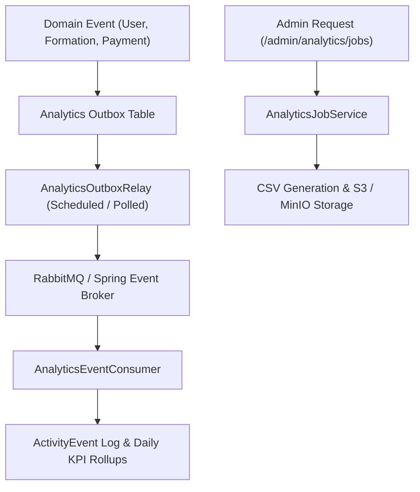

# Analytics Engine (`com.project.souklab.analytics`)

Asynchronous analytics processing, transactional outbox event relaying, multi-granularity KPI rollups, and reporting jobs.

---

## Architecture & Data Flow

---

## Core Classes & Responsibilities

| Class | Responsibility |
| :--- | :--- |
| [`ActivityEventService`](ActivityEventService.java) | Records domain activity events (logins, catalog interactions, enrollments) into the activity event log. |
| [`AnalyticsBackfillService`](AnalyticsBackfillService.java) | Bounded historical backfill of daily KPI rollups across custom date ranges. |
| [`AnalyticsEventConsumer`](AnalyticsEventConsumer.java) | Asynchronous consumer receiving events from the broker and dispatching to rollup services. |
| [`AnalyticsEvent`](AnalyticsEvent.java) | Typed domain event payload representing tracked actions. |
| [`AnalyticsJobService`](AnalyticsJobService.java) | Async query job orchestration, status transitions (`QUEUED`, `RUNNING`, `COMPLETED`, `FAILED`), and CSV artifact generation. |
| [`AnalyticsMaintenanceJobService`](AnalyticsMaintenanceJobService.java) | Manages administrative maintenance tasks (rebuilds, backfills, retention purges). |
| [`AnalyticsMetric`](AnalyticsMetric.java) | Metric calculation definitions (users, formations, reviews, revenue) with financial vs operational permission separation. |
| [`AnalyticsOutboxRelay`](AnalyticsOutboxRelay.java) | Transactional Outbox pattern relay polling unpublished outbox events and pushing to RabbitMQ. |
| [`AnalyticsRebuildService`](AnalyticsRebuildService.java) | Full rebuild of daily KPI rollups from raw activity events. |
| [`AnalyticsRetentionCleanup`](AnalyticsRetentionCleanup.java) | Scheduled retention cleanup pruning raw activity events past their retention horizon. |
| [`RollupService`](RollupService.java) | Core daily KPI calculation and rollup persistence engine. |
