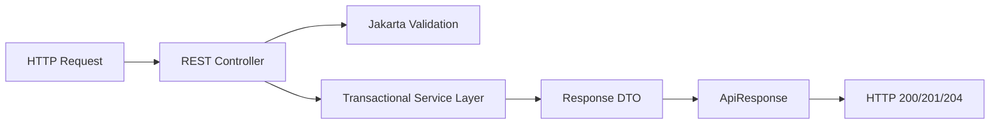

# Controller Layer (`com.project.souklab.controller`)

HTTP adapter layer exposing RESTful endpoints according to API conventions.

---

## Architectural Principles

- **Thin Controllers**: Controllers contain no business logic; they validate incoming requests, delegate to application services, and wrap results in standard `ApiResponse` or `PaginatedResponse` wrappers.
- **Consistent Envelopes**: All successful responses return `ApiResponse<T>`, and all paginated list endpoints return `ApiResponse<PaginatedResponse<T>>`.
- **Security Scoping**: Endpoints enforce centralized permission policies through `AccessControlService`; no persisted role model or role compatibility layer remains.
- **Input Validation**: Request bodies are validated using `@Valid` and Jakarta constraints.

---

## Subpackages

| Subpackage | Purpose |
| :--- | :--- |
| [`artisan`](artisan/README.md) | Artisan profile updates, public profile viewing, portfolio certifications, and gallery images. |
| [`auth`](auth/README.md) | Registration, login, email verification, token refreshing, password management. |
| [`catalog`](catalog/README.md) | Public reference taxonomy endpoints and administrative taxonomy CRUD management. |
| [`directory`](directory/README.md) | Public artisan discovery search engine and multi-facet directory filtering. |
| [`formateur`](formateur/README.md) | Formateur teacher accreditation applications, administrative review, grant, and revocation. |
| [`formation`](formation/README.md) | Artisan masterclass authoring, peer workshop enrollment, syllabus downloads, and administrative moderation. |
| [`notification`](notification/README.md) | User in-app notification queries, unread counts, mark-read, and soft deletion. |
| [`chat`](chat/README.md) | Private conversation, message lifecycle, attachment, and read-state endpoints. |
| [`user`](user/README.md) | Administrative user management, timeouts, bans, and user avatar gallery operations. |
