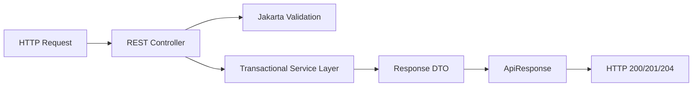

# Controller Layer (`com.project.souklab.controller`)

HTTP adapter layer exposing RESTful endpoints according to API conventions.

---

## Architectural Principles

- **Thin Controllers**: Controllers contain no business logic; they validate incoming requests, delegate to application services, and wrap results in standard `ApiResponse` or `PaginatedResponse` wrappers.
- **Consistent Envelopes**: All successful responses return `ApiResponse<T>`, and all paginated list endpoints return `ApiResponse<PaginatedResponse<T>>`.
- **Security Scoping**: Endpoints enforce centralized permission policies through `AccessControlService`; no persisted role model or role compatibility layer remains.
- **Input Validation**: Request bodies are validated using `@Valid` and Jakarta constraints.

---

## Subpackages

| Subpackage | Purpose |
| :--- | :--- |
| [`analytics`](analytics/README.md) | Administrative async analytics query jobs, CSV artifact downloads, KPI rollups, and platform stats. |
| [`artisan`](artisan/README.md) | Public artisan profile viewing (`/api/v1/artisan/{id}`), portfolio certifications, and showcase gallery. |
| [`auth`](auth/README.md) | Registration, login, token refresh, email verification, passwords, and current profile lifecycle (`/api/v1/auth/me`). |
| [`catalog`](catalog/README.md) | Public reference taxonomy endpoints and administrative taxonomy CRUD management. |
| [`chat`](chat/README.md) | Private conversations, cursor-paginated messages, file attachments, and STOMP WebSocket endpoints. |
| [`directory`](directory/README.md) | Authenticated artisan discovery search engine with dynamic contact identity privacy gating. |
| [`feed`](feed/README.md) | Public feed posts, media attachments, and administrative post moderation. |
| [`formateur`](formateur/README.md) | Formateur teacher accreditation applications, administrative review, grant, and revocation. |
| [`formation`](formation/README.md) | Artisan masterclass authoring, peer workshop enrollment, syllabus downloads, and administrative moderation. |
| [`notification`](notification/README.md) | User in-app notification queries, unread counts, mark-read, and soft deletion. |
| [`report`](report/README.md) | Content reporting and administrative moderation resolution. |
| [`review`](review/README.md) | Formation-backed decimal artisan review endpoints and ratings. |
| [`subscription`](subscription/README.md) | Tiered subscription plans, Chargily Pay V2 checkout, signature-verified webhooks, and billing account state. |
| [`user`](user/README.md) | Administrative user management, timeouts, bans, and user avatar gallery operations (`/api/v1/users/me/avatars`). |

