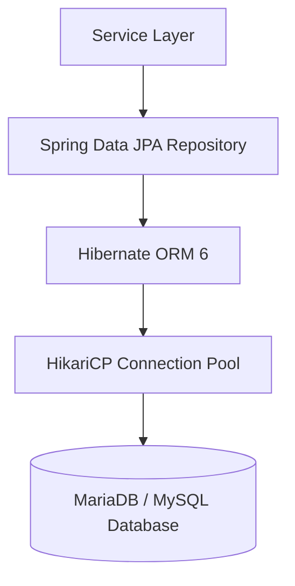

# Data Access Object Layer (`com.project.souklab.dao`)

Spring Data JPA repository interfaces defining database queries, soft-delete filtering, and pagination contracts.

---

## Architecture & Data Flow

Repositories inherit from `JpaRepository` and `JpaSpecificationExecutor`. All queries touching entities with soft-delete support automatically include `deletedAt IS NULL` conditions to maintain data integrity.

---

## Repositories Reference (25 Repositories)

### Identity, Security & Auditing
| Repository Interface | Managed Entity | Key Query Capabilities |
| :--- | :--- | :--- |
| [`UserRepository`](UserRepository.java) | `User` | `findByEmail`, `existsByEmail`, `findByStatusAndDeletedAtIsNull`, search query filters. |
| [`RoleRepository`](RoleRepository.java) | `Role` | `findByName` (`ROLE_CLIENT`, `ROLE_ARTISAN`, `ROLE_ADMIN`). |
| [`RefreshTokenRepository`](RefreshTokenRepository.java) | `RefreshToken` | `findByToken`, `deleteByUser`, revocation cleanup. |
| [`VerificationTokenRepository`](VerificationTokenRepository.java) | `VerificationToken` | `findActiveToken`, `invalidateActiveTokens` for email verification and password reset. |
| [`OAuthIdentityRepository`](OAuthIdentityRepository.java) | `OAuthIdentity` | `findByProviderAndProviderUserId`, OAuth account linking. |
| [`AuditLogRepository`](AuditLogRepository.java) | `AuditLog` | `findByActionOrderByCreatedAtDesc`, administrative audit queries. |

### Profiles & Portfolios
| Repository Interface | Managed Entity | Key Query Capabilities |
| :--- | :--- | :--- |
| [`ArtisanRepository`](ArtisanRepository.java) | `Artisan` | `findById`, `findByTeacherTrue`, `findByVerifiedTrue`, public directory lookups. |
| [`ClientRepository`](ClientRepository.java) | `Client` | `findById`, `findByPremiumTrue`. |
| [`ArtisanFormateurRequestRepository`](ArtisanFormateurRequestRepository.java) | `ArtisanFormateurRequest` | `findFirstByArtisanIdOrderByCreatedAtDesc`, `findByStatusAndDeletedAtIsNullOrderByCreatedAtDesc`. |
| [`ArtisanProfileViewRepository`](ArtisanProfileViewRepository.java) | `ArtisanProfileView` | `existsByViewerIdAndArtisanId`, deduplicated profile view metrics. |
| [`UserAvatarRepository`](UserAvatarRepository.java) | `UserAvatar` | `findByUserIdOrderByCreatedAtDesc`, `countByUserId`, `findByUserIdAndIsActiveTrue`. |
| [`ArtisanCertificationRepository`](ArtisanCertificationRepository.java) | `ArtisanCertification` | `findByArtisanIdAndDeletedAtIsNullOrderByCreatedAtDesc`, credential management. |
| [`ArtisanGalleryImageRepository`](ArtisanGalleryImageRepository.java) | `ArtisanGalleryImage` | `findByArtisanIdAndDeletedAtIsNullOrderByDisplayOrderAsc`, showcase sequence queries. |
| [`NotificationRepository`](NotificationRepository.java) | `Notification` | `findByRecipientIdAndDeletedAtIsNullOrderByCreatedAtDesc`, `countByRecipientIdAndReadFalseAndDeletedAtIsNull`, query-scoped mark-read. |

### Reference Taxonomies
| Repository Interface | Managed Entity | Key Query Capabilities |
| :--- | :--- | :--- |
| [`RegionRepository`](RegionRepository.java) | `Region` | `findByParentIsNullAndIsActiveTrueOrderByDisplayOrderAsc`, `findByParentIdAndIsActiveTrueOrderByDisplayOrderAsc`. |
| [`JobCategoryRepository`](JobCategoryRepository.java) | `JobCategory` | `findByIsActiveTrueOrderByDisplayOrderAsc`, craftsmanship category hierarchy. |
| [`JobSubCategoryRepository`](JobSubCategoryRepository.java) | `JobSubCategory` | `findByCategoryIdAndIsActiveTrueOrderByDisplayOrderAsc`, specialized craft subcategories. |
| [`MaterialFamilyRepository`](MaterialFamilyRepository.java) | `MaterialFamily` | `findByIsActiveTrueOrderByDisplayOrderAsc`, raw material family hierarchy. |
| [`MaterialRepository`](MaterialRepository.java) | `Material` | `findByFamilyIdAndIsActiveTrueOrderByDisplayOrderAsc`, constituent craft materials. |
| [`EpoqueRepository`](EpoqueRepository.java) | `Epoque` | `findByIsActiveTrueOrderByDisplayOrderAsc`, chronological historical epochs. |
| [`TechniqueRepository`](TechniqueRepository.java) | `Technique` | `findByIsActiveTrueOrderByDisplayOrderAsc`, traditional craftsmanship techniques. |

### Formations & Workshops
| Repository Interface | Managed Entity | Key Query Capabilities |
| :--- | :--- | :--- |
| [`FormationRepository`](FormationRepository.java) | `Formation` | `findByStatusAndDeletedAtIsNull`, `findByAuthorIdAndDeletedAtIsNull`, browse and author queries. |
| [`FormationEnrollmentRepository`](FormationEnrollmentRepository.java) | `FormationEnrollment` | `countByFormationIdAndStatus`, `findByFormationIdAndArtisanId`, seat capacity checks. |
| [`FormationFileRepository`](FormationFileRepository.java) | `FormationFile` | `findByFormationIdAndDeletedAtIsNull`, course syllabus attachments. |
| [`FormationReviewRepository`](FormationReviewRepository.java) | `FormationReview` | `findByFormationIdOrderByReviewedAtDesc`, administrative review history. |
