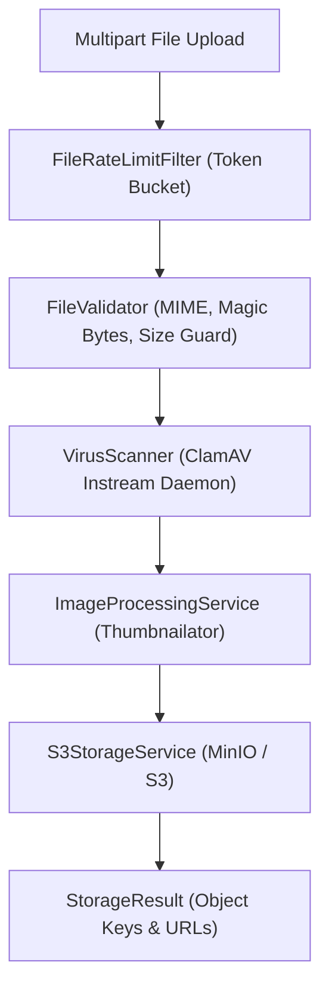

# File Storage Engine (`com.project.souklab.filestorage`)

Autonomous enterprise-grade storage subsystem supporting S3-compatible backends (MinIO, AWS S3, Cloudflare R2), inline virus scanning, and multi-tier image transformations.

---

## Architectural Pipeline

---

## Core Interfaces, Utilities & Value Objects

| Interface / Class | Type | Responsibility |
| :--- | :---: | :--- |
| [`StorageService`](StorageService.java) | Interface | Provider-neutral contract defining stream upload, download, delete, and existence operations. |
| [`StorageResource`](StorageResource.java) | Value Object | Encapsulates input stream, content length, and MIME type for streaming downloads. |
| [`StorageResult`](StorageResult.java) | Value Object | Contains storage key, resolved access URL, file size, and bucket metadata. |
| [`FileUrlResolver`](FileUrlResolver.java) | Utility Class | Resolves physical object keys to accessible HTTP URLs using configured public prefixes. |

---

## Subpackages Overview

| Subpackage | Responsibility |
| :--- | :--- |
| [`config`](config/README.md) | Externalized S3 connection settings and conditional bean registrations. |
| [`controller`](controller/README.md) | Protected file streaming endpoint. |
| [`exception`](exception/README.md) | Specialized storage and scanning exception taxonomy. |
| [`image`](image/README.md) | Thumbnailator image resizing and resolution tier generation. |
| [`s3`](s3/README.md) | Production S3 SDK client adapter. |
| [`scan`](scan/README.md) | ClamAV antivirus instream socket scanner. |
| [`security`](security/README.md) | File retrieval rate limit filter. |
| [`stub`](stub/README.md) | In-memory storage implementation for lightweight testing. |
| [`validation`](validation/README.md) | Magic number verification, size-limiting input streams, and MIME checks. |
| [`lifecycle`](lifecycle/README.md) | Transaction-aware post-commit object cleanup. |

The storage engine deliberately contains no user, role, or domain authorization rules. Applications compose it with their own access-policy service before serving an object. This keeps the provider adapters reusable across projects.
