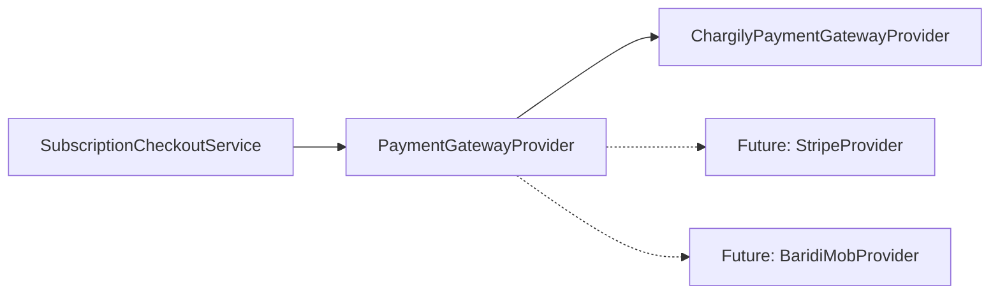

# Payment Gateway Provider SPI (`com.project.souklab.integration.payment`)

Service Provider Interface (SPI) decoupling checkout orchestration and subscription billing from external payment vendor SDKs.

---

## Architecture

---

## Component Reference

| Interface / Class | Type | Responsibility |
| :--- | :---: | :--- |
| [`PaymentGatewayProvider`](PaymentGatewayProvider.java) | Interface | Service Provider Interface defining payment provider identity and checkout session creation. |
| [`PaymentCheckoutCommand`](PaymentCheckoutCommand.java) | Record | Vendor-neutral parameters for initiating a checkout session. |
| [`PaymentCheckoutResult`](PaymentCheckoutResult.java) | Record | Normalized result containing checkout ID and redirection URL. |
| [`ChargilyPaymentGatewayProvider`](ChargilyPaymentGatewayProvider.java) | `@Component` | Chargily Pay V2 adapter implementing `PaymentGatewayProvider`. |
