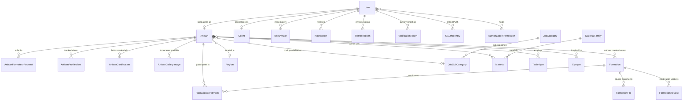

# Domain Model Layer (`com.project.souklab.model`)

JPA entity models, enums, and base lifecycle abstractions mapped to MariaDB/MySQL tables.

---

## Entity Relationship Diagram

---

## Entities & Enums Reference (44 Model Types)

### Lifecycle & Identity Core
| Class / Enum | Type | Description |
| :--- | :---: | :--- |
| [`BaseEntity`](BaseEntity.java) | `@MappedSuperclass` | Auto-generated UUID `id`, `createdAt`, `updatedAt`, and soft-delete `deletedAt` timestamps. |
| [`User`](User.java) | `@Entity` | Central identity: email, password, `AccountStatus`, ban tracking, and direct permissions. |
| [`Client`](Client.java) | `@Entity` | Client profile: client type, company name, premium membership status. |
| [`AuthorizationPermission`](AuthorizationPermission.java) | `@Entity` | Persisted capability assigned directly to users and evaluated by the security layer. |
| [`RefreshToken`](RefreshToken.java) | `@Entity` | Long-lived secure token for JWT rotation with expiry tracking. |
| [`VerificationToken`](VerificationToken.java) | `@Entity` | Single-use 6-digit OTP codes for email activation and password resets. |
| [`OAuthIdentity`](OAuthIdentity.java) | `@Entity` | Third-party OAuth provider binding (Google OAuth2 subject ID). |
| [`AuditLog`](AuditLog.java) | `@Entity` | Administrative audit trail capturing security events and moderation actions. |
| [`AccountStatus`](AccountStatus.java) | `enum` | Account states: `PENDING`, `ACTIVE`, `SUSPENDED`. |
| [`AuditLogAction`](AuditLogAction.java) | grouped enum taxonomy | Audit codes grouped by domain (`AuditLogAction.User.APPROVED`, `AuditLogAction.Authentication.EMAIL_VERIFIED`). |
| [`VerificationTokenType`](VerificationTokenType.java) | `enum` | Token categories: `EMAIL_VERIFICATION`, `PASSWORD_RESET`. |

### Artisan Profiles & Portfolios
| Class / Enum | Type | Description |
| :--- | :---: | :--- |
| [`Artisan`](Artisan.java) | `@Entity` | Artisan details: bio, ratings, `isTeacher`, views, craft associations. |
| [`ArtisanCertification`](ArtisanCertification.java) | `@Entity` | Official qualification/certificate with credential title, issuer, dates, document URL. |
| [`ArtisanGalleryImage`](ArtisanGalleryImage.java) | `@Entity` | Portfolio showcase photograph with caption and display sequence order. |
| [`ArtisanProfileView`](ArtisanProfileView.java) | `@Entity` | Deduplicated profile impression tracking unique viewer-artisan pairs. |
| [`ArtisanFormateurRequest`](ArtisanFormateurRequest.java) | `@Entity` | Teacher accreditation request with review notes and reapply cooldown date. |
| [`UserAvatar`](UserAvatar.java) | `@Entity` | Gallery avatar entity with thumbnail, medium, and full resolution URLs. |
| [`Notification`](Notification.java) | `@Entity` | In-app notification with recipient reference, message, type, and read flag. |
| [`FormateurRequestStatus`](FormateurRequestStatus.java) | `enum` | Accreditation states: `PENDING`, `APPROVED`, `REJECTED`. |
| [`NotificationType`](NotificationType.java) | grouped enum taxonomy | Notification triggers grouped by domain (`NotificationType.Account.VALIDATED`, `NotificationType.Formateur.GRANTED`, etc.). |

### Reference Taxonomies
| Class / Enum | Type | Description |
| :--- | :---: | :--- |
| [`Region`](Region.java) | `@Entity` | Administrative geography: Wilayas (parent is null) and child Communes. |
| [`JobCategory`](JobCategory.java) | `@Entity` | Top-level craft category (e.g. Pottery, Leathercraft, Weaving). |
| [`JobSubCategory`](JobSubCategory.java) | `@Entity` | Specialized subcategory belonging to a parent category. |
| [`MaterialFamily`](MaterialFamily.java) | `@Entity` | Material grouping (e.g. Clay & Ceramics, Metals, Textiles). |
| [`Material`](Material.java) | `@Entity` | Specific raw craft material belonging to a family. |
| [`Epoque`](Epoque.java) | `@Entity` | Traditional historical period and cultural era in Algerian heritage. |
| [`Technique`](Technique.java) | `@Entity` | Traditional craftsmanship method or technique. |

### Formations & Workshops
| Class / Enum | Type | Description |
| :--- | :---: | :--- |
| [`Formation`](Formation.java) | `@Entity` | Masterclass entity: title, description, schedule, capacity, price, status, author. |
| [`FormationEnrollment`](FormationEnrollment.java) | `@Entity` | Artisan workshop reservation with participant reference and status. |
| [`FormationFile`](FormationFile.java) | `@Entity` | Course document or syllabus attachment with storage key and MIME type. |
| [`FormationReview`](FormationReview.java) | `@Entity` | Administrative moderation record with decision and reviewer comment. |
| [`FormationStatus`](FormationStatus.java) | `enum` | Formation states: `DRAFT`, `PENDING_REVIEW`, `APPROVED`, `REJECTED`, `PUBLISHED`. |
| [`EnrollmentStatus`](EnrollmentStatus.java) | `enum` | Enrollment states: `CONFIRMED`, `ATTENDED`, `CANCELLED`. |
| [`FormationReviewDecision`](FormationReviewDecision.java) | `enum` | Admin verdicts: `APPROVED`, `REJECTED`. |

### Social Feed, Reviews & Reports
| Class / Enum | Type | Description |
| :--- | :---: | :--- |
| [`FeedPost`](FeedPost.java) | `@Entity` | Moderated public community post. |
| [`FeedPostMedia`](FeedPostMedia.java) | `@Entity` | Provider-neutral image attachment for a feed post. |
| [`ArtisanReview`](ArtisanReview.java) | `@Entity` | Decimal-rated review linked to an attended formation enrollment. |
| [`ContentReport`](ContentReport.java) | `@Entity` | Auditable report targeting a user, post, or review. |
| [`FeedPostType`](FeedPostType.java), [`FeedPostStatus`](FeedPostStatus.java) | `enum` | Feed categorization and moderation visibility states. |
| [`ReviewStatus`](ReviewStatus.java), [`ReportTargetType`](ReportTargetType.java), [`ReportStatus`](ReportStatus.java), [`ReportResolutionAction`](ReportResolutionAction.java) | `enum` | Review visibility, report target, lifecycle, and resolution states. |
