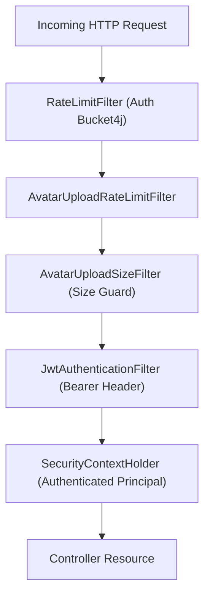

# Security & Filtering Layer (`com.project.souklab.security`)

Spring Security filters, JWT extraction, rate limiting mechanisms, and OAuth2 success handlers.

---

## Authorization model

`AuthorizationPermission` is the canonical persisted capability. `AccessControlService` exposes reusable predicates for method security and domain workflows. JWTs carry an authorization schema version while current permissions are resolved from the database whenever the principal is loaded. Account type is onboarding metadata, not an authorization mechanism.

The complete capability-to-endpoint matrix is maintained in [`docs/AUTHORIZATION_MATRIX.md`](../../../../../../../docs/AUTHORIZATION_MATRIX.md). The current model contains 12 capabilities and intentionally has no role compatibility layer.

## Security Filter Pipeline

---

## Classes Reference

| Filter / Component | Type | Responsibility |
| :--- | :---: | :--- |
| [`JwtAuthenticationFilter`](JwtAuthenticationFilter.java) | `OncePerRequestFilter` | Extracts `Bearer` token from `Authorization` header, validates signature and expiration, and populates `SecurityContextHolder`. |
| [`JwtUtils`](JwtUtils.java) | Component | Encapsulates JJWT logic: generates signed access and refresh tokens using the configured lifetimes, extracts username/claims, and verifies signatures. |
| [`RateLimitFilter`](RateLimitFilter.java) | `OncePerRequestFilter` | Bucket4j rate limiting backed by the configured shared Redis store in production. |
| [`AvatarUploadRateLimitFilter`](AvatarUploadRateLimitFilter.java) | `OncePerRequestFilter` | Dedicated rate limit filter protecting multipart avatar upload endpoints from denial-of-service bursting. |
| [`AvatarUploadSizeFilter`](AvatarUploadSizeFilter.java) | `OncePerRequestFilter` | Inspects `Content-Length` and early stream boundaries to reject oversized avatar payloads before memory buffering. |
| [`OAuth2AuthenticationSuccessHandler`](OAuth2AuthenticationSuccessHandler.java) | Handler | Processes successful Google OAuth2 callbacks: creates or links user accounts, checks account-type intent cookies, and issues JWT tokens. |
| [`Permission`](Permission.java) | Authorization contract | Defines the stable granular permission identifiers used by persistence and policy checks. |
| [`AccessControlService`](AccessControlService.java) | Policy facade | Provides centralized Spring method-security predicates for administrator, artisan, profile, and report access. |
