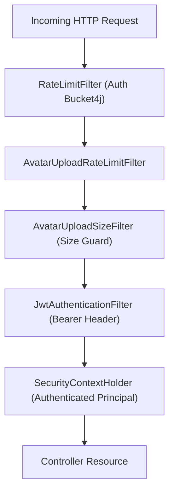

# Security & Filtering Layer (`com.project.souklab.security`)

Spring Security filters, JWT extraction, rate limiting mechanisms, and OAuth2 success handlers.

---

## Authorization model

`RoleName` preserves the persisted `ROLE_*` compatibility contract. `RolePermissionMapper` maps each role to type-safe `Permission` authorities, and `AccessControlService` exposes reusable predicates for method security and domain workflows. JWTs remain subject-based; current database roles are resolved whenever the principal is loaded.

## Security Filter Pipeline

---

## Classes Reference

| Filter / Component | Type | Responsibility |
| :--- | :---: | :--- |
| [`JwtAuthenticationFilter`](JwtAuthenticationFilter.java) | `OncePerRequestFilter` | Extracts `Bearer` token from `Authorization` header, validates signature and expiration, and populates `SecurityContextHolder`. |
| [`JwtUtils`](JwtUtils.java) | Component | Encapsulates JJWT logic: generates signed JWTs (access token 15 min, refresh token 7 days), extracts username/claims, verifies signatures. |
| [`RateLimitFilter`](RateLimitFilter.java) | `OncePerRequestFilter` | Sliding window rate limiting on authentication endpoints (`/auth/login`, `/auth/register`) backed by Caffeine cache and Bucket4j. |
| [`AvatarUploadRateLimitFilter`](AvatarUploadRateLimitFilter.java) | `OncePerRequestFilter` | Dedicated rate limit filter protecting multipart avatar upload endpoints from denial-of-service bursting. |
| [`AvatarUploadSizeFilter`](AvatarUploadSizeFilter.java) | `OncePerRequestFilter` | Inspects `Content-Length` and early stream boundaries to reject oversized avatar payloads before memory buffering. |
| [`OAuth2AuthenticationSuccessHandler`](OAuth2AuthenticationSuccessHandler.java) | Handler | Processes successful Google OAuth2 callbacks: creates or links user accounts, checks role intent cookies, and issues JWT tokens. |
| [`Permission`](Permission.java) / [`RolePermissionMapper`](RolePermissionMapper.java) | Authorization contract | Defines granular permissions and maps legacy roles to permission and compatibility authorities. |
| [`AccessControlService`](AccessControlService.java) | Policy facade | Provides centralized Spring method-security predicates for administrator and artisan access. |
