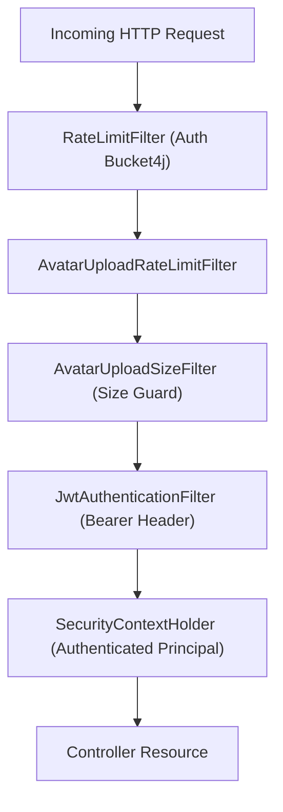

# Security & Filtering Layer (`com.project.souklab.security`)

Spring Security filters, JWT extraction, rate limiting mechanisms, and OAuth2 success handlers.

---

## Authorization model

`AuthorizationPermission` is the canonical persisted capability. `AccessControlService` exposes reusable predicates for method security and domain workflows. JWTs carry an authorization schema version while current permissions are resolved from the database whenever the principal is loaded. Account type is onboarding metadata, not an authorization mechanism.

The complete capability-to-endpoint matrix is maintained in [`docs/AUTHORIZATION_MATRIX.md`](../../../../../../../docs/AUTHORIZATION_MATRIX.md). The current model contains 16 capabilities and intentionally has no role compatibility layer.

## Security Filter Pipeline

```mermaid
graph TD
    Request["Incoming HTTP Request"] --> RateLimit["RateLimitFilter (Auth Bucket4j)"]
    RateLimit --> UploadRate["AvatarUploadRateLimitFilter"]
    UploadRate --> UploadSize["AvatarUploadSizeFilter (Size Guard)"]
    UploadSize --> JWT["JwtAuthenticationFilter (Bearer Header)"]
    JWT --> SecurityCtx["SecurityContextHolder (Authenticated Principal)"]
    SecurityCtx --> Endpoint["Controller Resource"]
```

---

## Classes Reference

| Filter / Component | Type | Responsibility |
| :--- | :---: | :--- |
| [`JwtAuthenticationFilter`](JwtAuthenticationFilter.java) | `OncePerRequestFilter` | Extracts `Bearer` token from `Authorization` header, validates signature and expiration, and populates `SecurityContextHolder`. |
| [`UserRateLimitFilter`](UserRateLimitFilter.java) | `OncePerRequestFilter` | Authenticated user rate limiting filter enforcing per-user request rate limits. |
| [`ChargilyWebhookSizeFilter`](ChargilyWebhookSizeFilter.java) | `OncePerRequestFilter` | Guards Chargily webhook callback endpoint by enforcing maximum payload size. |
| [`JwtUtils`](JwtUtils.java) | Component | Encapsulates JJWT 0.12.6 logic: generates signed access and refresh tokens using HMAC-SHA (HS512 for keys >= 64 bytes, HS256 for 32-63 bytes) and configured lifetimes, extracts username/claims, and verifies signatures with non-deprecated parser APIs. |
| [`RateLimitFilter`](RateLimitFilter.java) | `OncePerRequestFilter` | Bucket4j rate limiting backed by the configured shared Redis store in production. |
| [`AvatarUploadRateLimitFilter`](AvatarUploadRateLimitFilter.java) | `OncePerRequestFilter` | Dedicated rate limit filter protecting multipart avatar upload endpoints from denial-of-service bursting. |
| [`AvatarUploadSizeFilter`](AvatarUploadSizeFilter.java) | `OncePerRequestFilter` | Inspects `Content-Length` and early stream boundaries to reject oversized avatar payloads before memory buffering. |
| [`OAuth2AuthenticationSuccessHandler`](OAuth2AuthenticationSuccessHandler.java) | Handler | Processes successful Google OAuth2 callbacks: validates verified email claim, provisions user accounts based on intent cookie, clears the intent cookie, prevents servlet session creation, and redirects with tokens. |
| [`OAuth2AuthenticationFailureHandler`](OAuth2AuthenticationFailureHandler.java) | Handler | Handles failed Google OAuth2 authentication attempts and redirects with error codes. |
| [`Permission`](Permission.java) | Authorization contract | Defines the stable granular permission identifiers used by persistence and policy checks. |
| [`AccessControlService`](AccessControlService.java) | Policy facade | Provides centralized Spring method-security predicates for administrator, artisan, profile, and report access. |
| [`ViewerPremiumResolver`](ViewerPremiumResolver.java) | Component | Resolves whether the current caller has active premium status to gate contact info and chat access. |

---

## Rate Limiting & OAuth Support

| Class | Responsibility |
| :--- | :--- |
| [`JwtClaim`](JwtClaim.java) | Standardized claim names used in JWT token payloads. |
| [`SecurityAuthority`](SecurityAuthority.java) | Authority representations and Spring Security authority converters. |
| [`RateLimitScope`](RateLimitScope.java) | Categorization scope for rate limit counters (e.g. per-IP or per-User). |
| [`RateLimitBucketStore`](RateLimitBucketStore.java) | Abstraction for storing and resolving Bucket4j rate limiting buckets. |
| [`OAuthCookie`](OAuthCookie.java) | Constants and cookie helpers for the OAuth account-type intent cookie (`souklab_oauth_intent`). |
| [`AuthorizationCodeStore`](AuthorizationCodeStore.java) | Contract for short-lived one-time OAuth authorization code exchange storage. |
| [`InMemoryAuthorizationCodeStore`](InMemoryAuthorizationCodeStore.java) | In-memory implementation of `AuthorizationCodeStore` for testing and standalone dev. |
| [`RedisAuthorizationCodeStore`](RedisAuthorizationCodeStore.java) | Redis-backed implementation of `AuthorizationCodeStore` with automatic TTL expiration. |
| [`PermissionDeserializer`](PermissionDeserializer.java) | Jackson deserializer for resolving `Permission` instances from JSON wire strings. |
