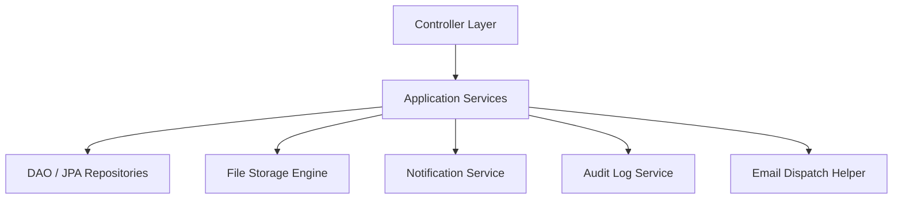

# Service Layer Architecture (`com.project.souklab.service`)

Core transactional business logic, domain state transitions, and coordination layer.

---

## Architectural Principles

- **Transactional Boundaries**: Methods that alter database state declare `@Transactional`. Read-only query methods declare `@Transactional(readOnly = true)` to optimize Hibernate dirty-checking and JDBC connection usage.
- **Decoupled Responsibilities**: Services interact through dependency injection of other services, repositories, or event dispatchers. Controllers never perform direct database manipulation.
- **Audit & Notification Side-Effects**: Critical state transitions (account verification, accreditation status changes, user discipline) record audit log entries and emit in-app or email notifications.

---

## Subpackages

| Subpackage | Domain Responsibility |
| :--- | :--- |
| [`artisan`](artisan/README.md) | Artisan profile updates, public profile sanitization, certifications, and portfolio gallery management. |
| [`audit`](audit/README.md) | Asynchronous system auditing and administrative audit log queries. |
| [`auth`](auth/README.md) | Credential verification, onboarding wizard, Spring Security user details. |
| [`catalog`](catalog/README.md) | Cached reference taxonomy retrieval and administrative catalog CRUD management. |
| [`chat`](chat/README.md) | Realtime 1-on-1 conversations, message delivery, read receipts, and typing indicators. |
| [`directory`](directory/README.md) | Public artisan directory search via Hibernate Search with Elasticsearch backend. |
| [`feed`](feed/README.md) | Public feed post authoring, media attachments, and administrative post moderation. |
| [`formateur`](formateur/README.md) | Artisan teacher accreditation lifecycle, applications, and cooldown tracking. |
| [`formation`](formation/README.md) | Peer masterclass authoring, syllabus document uploads, capacity limits, and review moderation. |
| [`notification`](notification/README.md) | In-app notification feeds, badge counter tracking, STOMP push broadcasts. |
| [`profile`](profile/README.md) | Profile lifecycle management, taxonomy foreign key wiring, and strongly-typed JSON patch mutations. |
| [`report`](report/README.md) | Abuse report filing, target entity inspection, and administrative resolution workflows. |
| [`review`](review/README.md) | Attended formation verification and decimal review rating calculation. |
| [`security`](security/README.md) | Cryptographic token management (verification tokens and refresh tokens). |
| [`storage`](storage/README.md) | Application-specific file access policies and enrollment syllabus download verification. |
| [`subscription`](subscription/README.md) | Subscription checkout, plan tiers, Chargily Pay V2 HMAC webhooks, and refund execution. |
| [`user`](user/README.md) | Administrative moderation (approvals, bans, timeouts) and avatar gallery management. |

*(Note: Async analytics and reporting jobs are orchestrated in the [`com.project.souklab.analytics`](../analytics/README.md) engine).*
