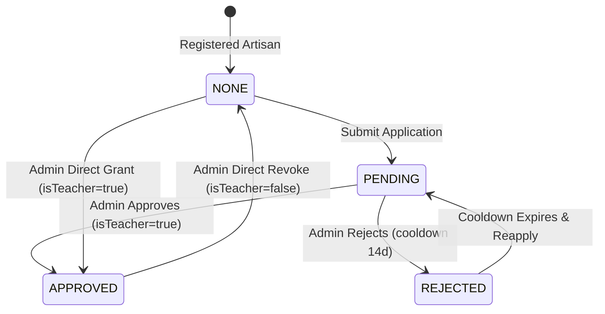

# Formateur Service Package (`com.project.souklab.service.formateur`)

Business logic governing the teacher certification and accreditation state machine for artisans.

---

## State Machine & Cooldown Rules

---

## Classes Reference

| Service Class | Responsibility |
| :--- | :--- |
| [`ArtisanFormateurService`](ArtisanFormateurService.java) | Manages application submission, single request lookups (artisan & admin views), duplicate prevention, 14-day reapply cooldown calculation, administrative approvals, rejections, direct grants, and revocations with dual dispatch (in-app notification + email). |
