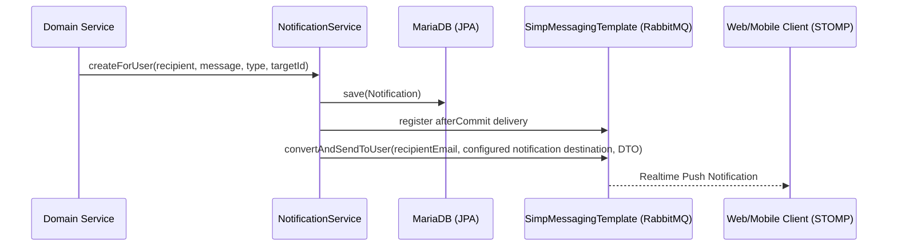

# Notification Service Package (`com.project.souklab.service.notification`)

Coordinates in-app notification records, badge counters, and realtime WebSocket push dispatch.

---

## Dual-Dispatch Mechanism

---

## Classes Reference

| Service Class | Responsibility |
| :--- | :--- |
| [`NotificationService`](NotificationService.java) | Handles notification persistence, paginated feeds excluding soft-deleted items (`deletedAt IS NULL`), unread counts, query-scoped mark-read, bulk mark-all-read, soft-delete updates, and post-commit STOMP delivery. |
| [`RealtimeNotificationAfterCommit`](RealtimeNotificationAfterCommit.java) | Named transaction synchronization that sends a persisted notification over STOMP after a successful commit. |
